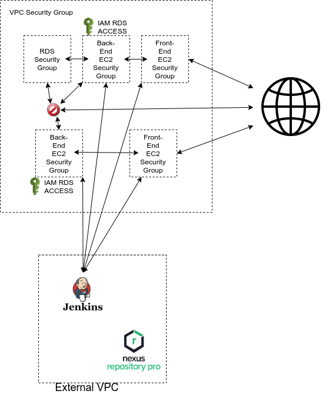
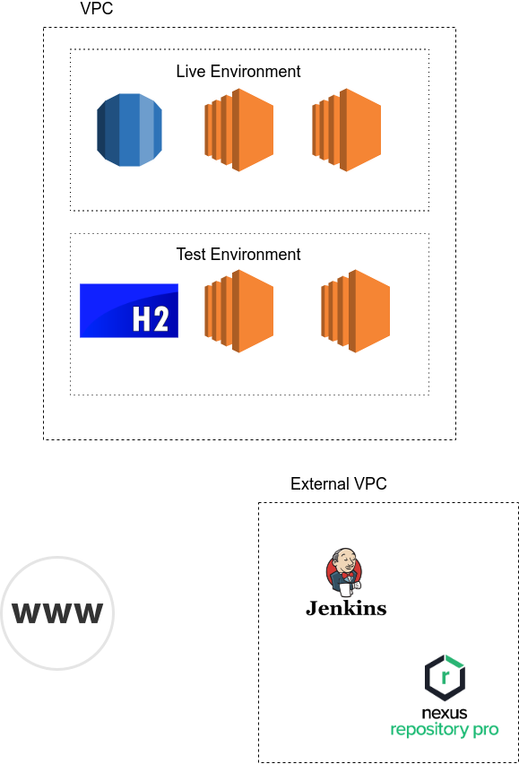
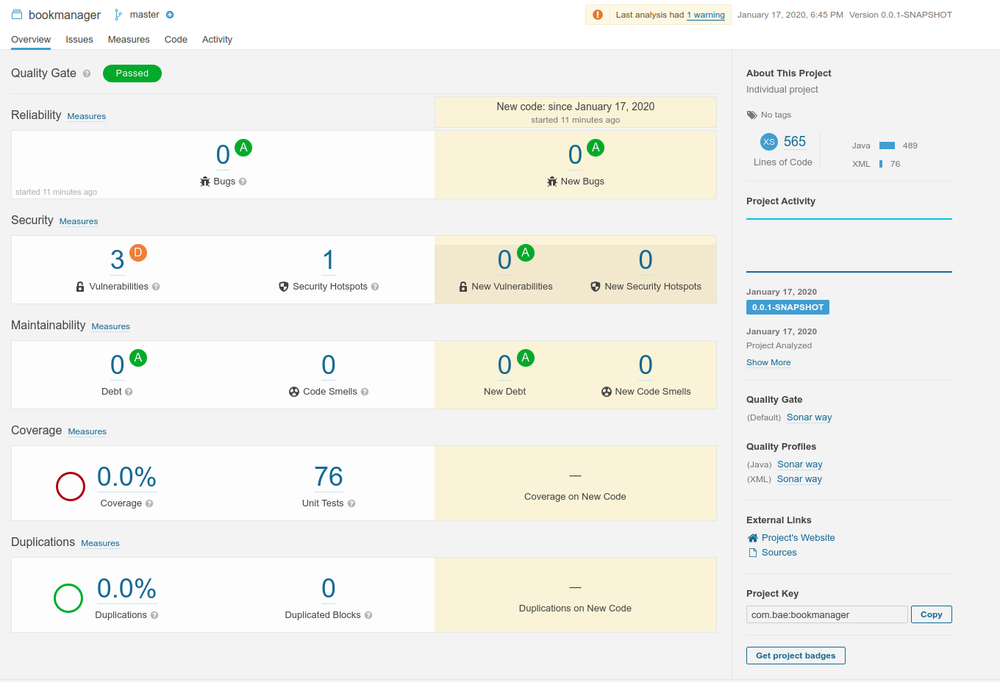

# DevOps Project

## Index
[Problem](#problem)
   * [Solution](#solution)
     
[Deployment](#depl)
   * [Technologies Used](#tech)
     
[Security](#Security)

[Step-by-step Walkthrough](#walkthrough)

[Testing](#testing)

[Future Improvements](#FutureImprovements)

### Problem
To create a fully-deployed version of a full-stack OOP application, with utilisation of supporting tools, methodologies and technologies that encapsulate all core modules covered during training.

### Solution
We created a fully-developed full stack application that utilised technologies and tools that made this implementation possible. These included the use of git as a VCS, Jenkins for a CI server, Nexus as an artifact repository and AWS for the testing and live environments.

### Deployment

#### Source Code
For our source code we utilised IDE's to make the work easier. These included Eclipse, Spring Tool Suite and VSCode. 

#### Version Control System
For our VCS we used Git. This allowed us to have our project on a central repository which enabled collaboration throughout.  

[Github Link]()

#### Project Tracking
We used Trllo boards for our project tracking. With Trello we were able to plan our story points and track their progress throughout the project. This ensured that we were not working on the same aspect of the project.  

[Our Trello board](https://trello.com/b/AnkEWU1u/dev-ops-project)

#### CI Server
We used Jenkins as our CI server. This automated our pipeline by using webhooks which listened to changes on our Github repository. This meant that once a change was made, if the tests passed then it would be pushed to the production environment.  

[For more information on Jenkins](https://jenkins.io/doc/)

#### Nexus and Docker
Nexus and Docker were used to manage and store dependencies and dockerhub was used to store built docker images.  

[For more information on Docker](https://docs.docker.com/)  

[For more information on Nexus](https://help.sonatype.com/repomanager3)

#### AWS
AWS was used for our MySQL database using the RDS service, our testing and production environments using EC2 instances.   

[For more information on AWS](https://docs.aws.amazon.com/)

### Security
The security that we used in our project include the use of passwords and multi factor authentication to gain access to the database and instances. We used IAM roles for database access. We also used security groups to protect against unauthorised access to the EC2 instances.
  
  
  

### Step-by-step Walkthrough
+ Set up accounts for technologies used
  + Nexus Repository
  + Docker Hub
  + Jenkins
  + Trello
  + AWS
  + Git
+ Create user stories on Trello to track project
+ Place project on VCS
+ Set up Jenkins to track desired branch from Git
+ Configure project pom to submit snapshot to Nexus on deployment with Maven
+ Use Jenkinsfile to configure automated pipeline to package, test and deploy the application and build a docker image which is pushed to Docker Hub as a back-up of previous versions
+ Set-up EC2 instances for testing and live stages as well as seperate instances for the front and back end. Use AWS RDS to create and launch a MySQL database to be used by the application. Use principle of least privilege to restrict access, use IAM roles for connection to the database, create security groups for increased security.

### Testing 
In our project we used multiple testing tools to test the project as it woved through the pipeline. This included JUnit, Selenium and Sonarqube.   

  
  

### Future Improvements
In the future we would like to implement tokenisation to avoid using root credentials in order to access the database. 
Implementing load balancers and auto-scaling groups
We also aim to implement the front-end deployment pipeline for Vue.

## Authors
Luke Cottenham  

Liam McIvor